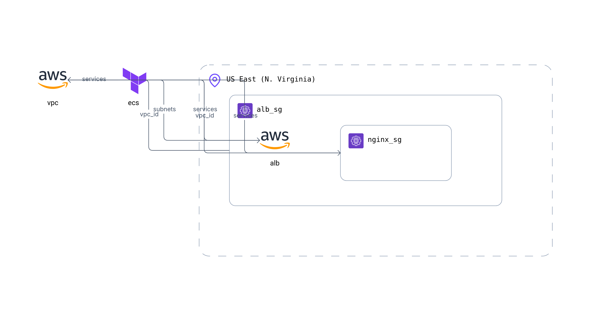

# AWS-ECS

This is an example repository containing Terraform and Dockerfile code. It contains the code to deploy a static web page using an unprivileged Nginx container running on ECS.  

## Tree
```
.
├── docker
│   ├── Dockerfile
│   └── index.html
├── misc
│   └── Brainboard.png    # Generated with https://app.brainboard.co
├── README.md
└── terraform
    ├── lb.tf             # We are using ALB to expose our web page.
    ├── main.tf
    ├── network.tf        # At least 2 publics subnets in differents AZ are required for ALB creation. We are using NAT gateway for instance internet connectivity.
    ├── provider.tf
    ├── security_group.tf
    └── variables.tf
```

## Architecture diagram



## Helpful informations

https://elasticscale.com/blog/why-your-aws-ecs-task-is-stuck-in-pendingand-what-to-do-about-it/

To get information on task in case it is stuck in `PENDING` status:
```shell
aws ecs describe-services --cluster ecs-nginx --services ecs-nginx
```
