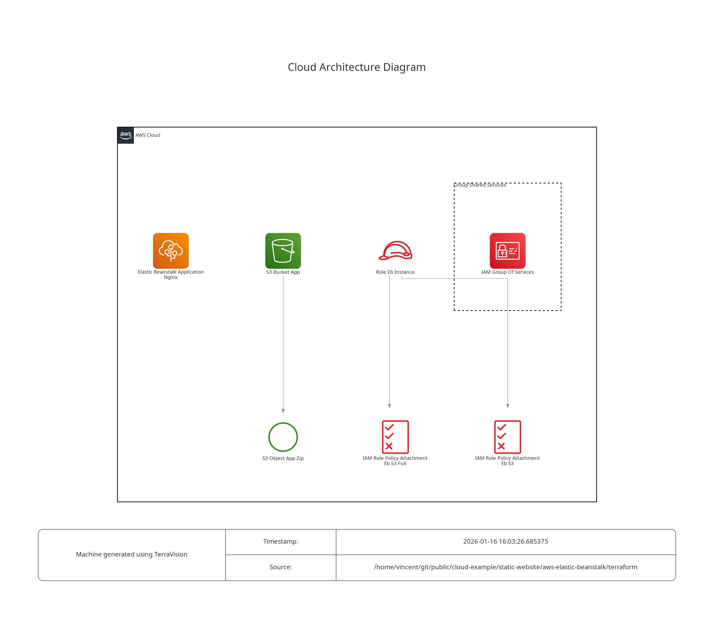

# AWS-Elastic-Beanstalk

This is an example repository containing Terraform code. It contains the code to deploy a static web page using AWS Elastic Beanstalk.  

## Tree
```
.
├── misc
│   └── architecture.dot.png   # Generated with https://github.com/patrickchugh/terravision
├── README.md
└── terraform
    ├── files
    │   ├── Dockerrun.aws.json
    │   └── Dockerrun.zip
    ├── iam.tf
    ├── main.tf
    ├── outputs.tf
    ├── provider.tf
    └── variables.tf
```

## Architecture diagram



## Helpful informations
