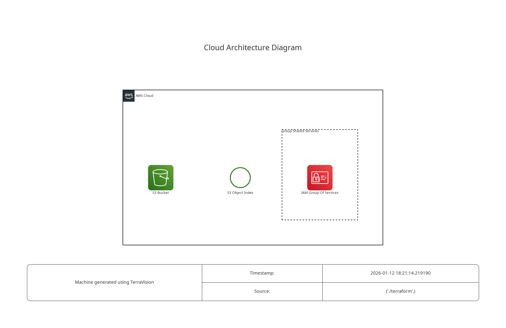

# AWS-S3

This is an example repository containing Terraform code. It contains the code to deploy a static web page using a S3 bucket.  

## Tree
```
.
├── misc
│   └── architecture.dot.png  # Generated with https://github.com/patrickchugh/terravision.
├── README.md
└── terraform
    ├── main.tf
    ├── provider.tf
    └── site
        └── index.html
```

## Architecture diagram



## Helpful informations

https://docs.aws.amazon.com/AmazonS3/latest/userguide/HostingWebsiteOnS3Setup.html
